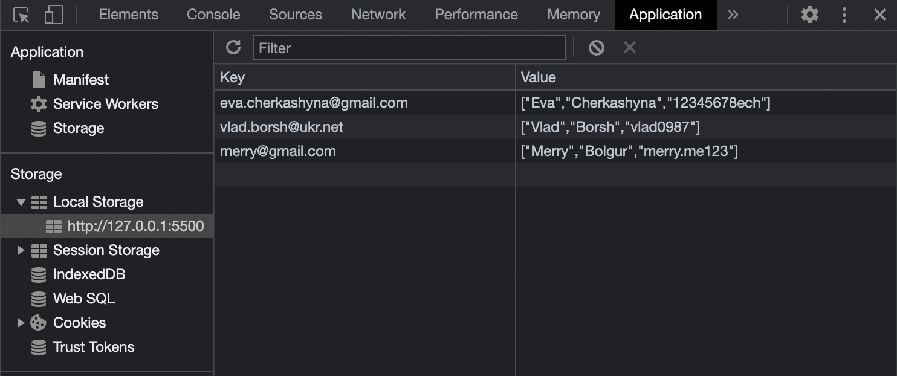

# Sign In and Sign Up Form

In this application, I implemented a registration form, a login form and a personal account.

# About

The application interacts with Local Storage. That is, after registration, your data is sent to Local Storage, and stored there, so that later you can log into your account.

 If you look at the photo, you can see that the `key` field contains email addresses, and the `value` field contains ___FirstName___ ___LastName___ ___Password___, respectively.

 # How it works

 When you enter your first and last name in the registration form, the program checks if you have capitalized them, if not, it will give an error. 
 

 I did the same with email. If you write any email that doesn't end with `@gmail.com` or `@ukr.net`, the program will give you an error. I did it with regular expressions.
 
 

  After registration, you must click on the button below "Sign in now" and enter your account.

# Download instructions

 

1. Copy the link you can find by clicking on the green button `Сode`.
2. In the terminal: `git clone link`
3. The project will be copied to the selected folder

